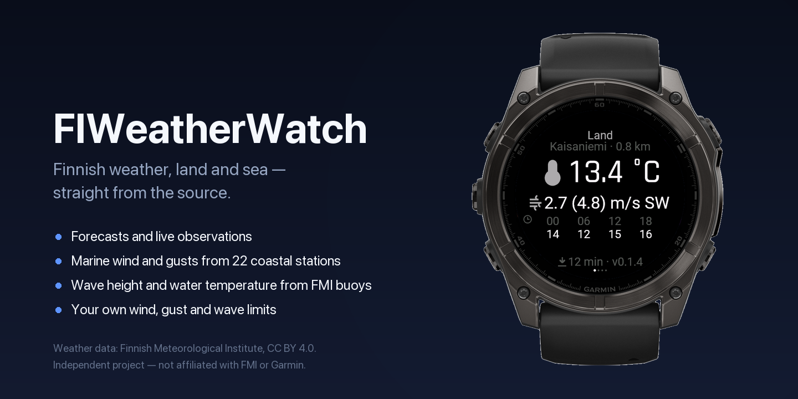
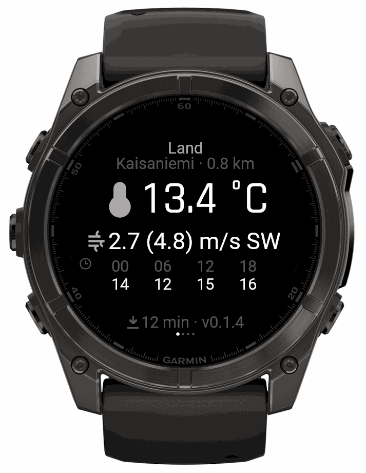
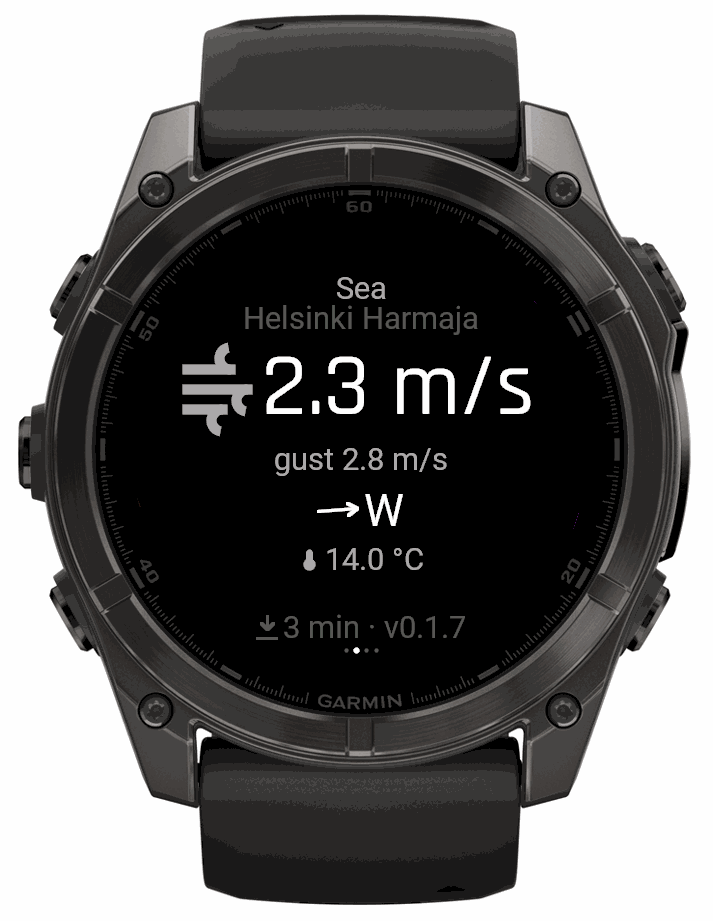
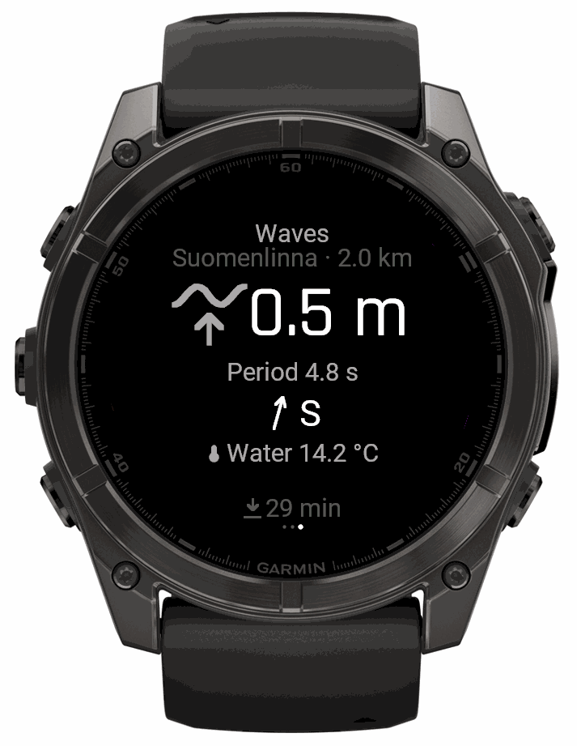

# FIWeatherWatch

Finnish weather on a Garmin watch — land forecasts, marine wind from the coastal
stations, and live wave height from the Finnish Meteorological Institute's own
wave buoys.



Independent project, not affiliated with or endorsed by the Finnish
Meteorological Institute or Garmin. Weather data from
[FMI open data](https://en.ilmatieteenlaitos.fi/open-data), licensed
[CC BY 4.0](https://creativecommons.org/licenses/by/4.0/).

## What it does

| Land | Sea | Waves |
|---|---|---|
|  |  |  |

- **Land** — current temperature and wind from the nearest reporting station,
  named, with its distance, plus a six-hourly forecast strip for the rest of
  the day.
- **Sea** — wind, gusts, direction and air temperature from any of 22 Finnish
  marine stations: Harmaja, Utö, Kalbådagrund, Bogskär, Märket and the rest.
- **Waves** — significant wave height, period, direction and sea water
  temperature from FMI's wave buoys, with the nearest reporting buoy chosen
  automatically.
- **Your own limits** — wind, gust, wave and temperature thresholds you set
  yourself; a reading is highlighted when it crosses one.
- **Glance** — any two values of your choosing in the widget carousel.
- **About** — build number and the data attribution.

Finnish, Swedish and English, following the watch's own language setting. Wind in
m/s, knots or Beaufort; distance in kilometres or nautical miles.

## Every value is timestamped

Stations do not report on a common schedule. Harmaja republishes wind every
minute, most stations manage every ten, and a wave buoy reports height every half
hour while sending water temperature every five minutes. Presenting them as one
reading taken at one moment would be a small, constant lie, so each value carries
its own age.

If the phone goes out of range the last reading stays on screen and says that it
is the last reading — for a marine app that is the normal case, not the edge
case.

## How it works

```
watch ⇄ phone/WiFi → weatherapp.tallimedia.com → opendata.fmi.fi
```

The watch talks to a small FastAPI service rather than to FMI directly. Three
reasons, none of them optional:

1. **Monkey C has no XML parser.** FMI's documented interface is WFS/GML, and
   wave-buoy observations exist *only* there.
2. **Connect IQ starts failing somewhere around 32 kB** of response. The
   warnings feed alone is 1.1 MB of CAP XML; the service turns all of it into a
   few hundred bytes of JSON.
3. **Garmin's root certificate store is thin.** The backend presents a
   certificate already proven to work on Garmin hardware.

There is no account, no sign-in and no pairing — every endpoint is public and
read-only. Settings are edited in Garmin Connect Mobile.

You can run your own instance if you would rather not use the hosted one; see
[`app/README.md`](app/README.md).

## Live data

[weatherapp.tallimedia.com](https://weatherapp.tallimedia.com) shows the same
data the watch does, in a browser — useful for checking a station before you
leave, and for seeing whether the wind is rising or falling over the last twelve
hours.

## Repository layout

| Path | What |
|---|---|
| `watch/` | the Connect IQ app (Monkey C) |
| `app/` | the FastAPI backend |
| `app/public/` | the public weather page |
| `Screenshots/` | simulator captures, and the framed versions for the store |
| `CHANGELOG.md` | release history |
| `dist/` | the current release: .iq, sideload .prg, store artwork |

## Building

```bash
# backend
python3.12 -m venv .venv && .venv/bin/pip install -e ".[dev]"
.venv/bin/uvicorn app.main:app --reload --port 8791
.venv/bin/pytest -q

# watch app
./watch/build-release.sh fenix847mm
```

`fenix847mm` is the development target; quatix 8 is API-identical and has no
separate simulator profile.

## Licence

**Code** — [PolyForm Noncommercial 1.0.0](LICENSE). Use it, change it, share it
for any noncommercial purpose; selling it is reserved.

**Weather data** — © Finnish Meteorological Institute, licensed
[CC BY 4.0](https://creativecommons.org/licenses/by/4.0/). The two are separate:
FMI's licence permits commercial use of the *data*, and nothing here restricts
that. The noncommercial terms cover this project's own code only.

Attribution to FMI is required wherever the data is shown, which is why it
appears on the watch's About page as well as here.
